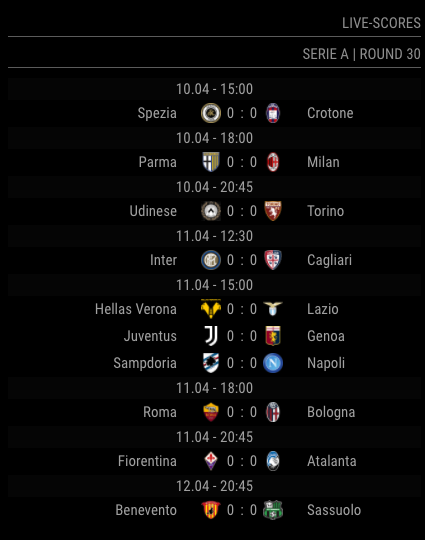
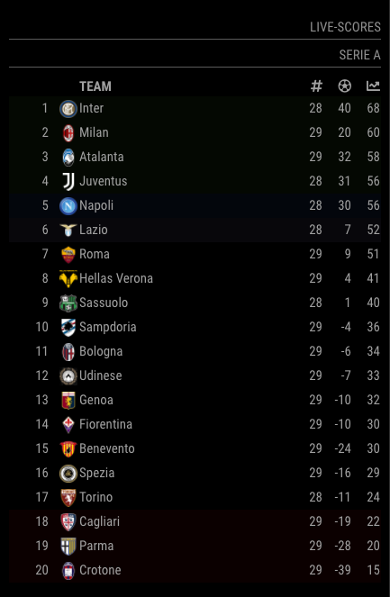

**fork of: https://github.com/mrtysn/MMM-SoccerLiveScore**

# MMM-SoccerLiveScore

This a module for the [MagicMirror](https://github.com/MichMich/MagicMirror).  
It displays live scores of your favorite soccer leagues and competitions.

## Preview

### Standing



### Table



### Scorers


### Standings & Details


## Installation

1. Navigate into your MagicMirror's `modules` folder and execute `git clone https://github.com/0m4r/MMM-SoccerLiveScore.git`.

## Config

The entry in `config.js` can include the following options:

| Option          | Description                                                                                                                                                                                                                                                                                                                                                                |
| --------------- | -------------------------------------------------------------------------------------------------------------------------------------------------------------------------------------------------------------------------------------------------------------------------------------------------------------------------------------------------------------------------- |
| `leagues`       | List of league-ID's you want to display. If you put more than one league the module switches automatically between them. A table with possible leagues and the related ID's can be found further down. **Type:** `integer`<br>**Example:** `[35, 1, 9]` <br>This value is **OPTIONAL** and if not specified it defaults to 1 (Uefa Champions League)                       |
| `showNames`     | Toggles teams names. <br><br>**Default value:** `true`                                                                                                                                                                                                                                                                                                                     |
| `showLogos`     | Toggles team logos.<br><br>**Default value:** `true`                                                                                                                                                                                                                                                                                                                       |
| `displayTime`   | defines how long the information for a league in `leagues` is shown on the screen. This screen time is used to display standings, tables and scorers. For example, if you specify `displayTime` to 30 seconds and `showTables=true`, `showStandings=true`and `showScorers=true` each information will be shown for about 10 seconds. <br><br>**Default value:** 20 \* 1000 |
| `showStandings` | display the standings for the league <br><br>**Default value:** `true`                                                                                                                                                                                                                                                                                                     |
| `showDetails`   | display the games scorers whit the standings for the league (it requires `showStandings: true` ) <br><br>**Default value:** `true`                                                                                                                                                                                                                                                                                        |
| `showTables`    | display the tables for the league (if available) <br><br>**Default value:** `true`                                                                                                                                                                                                                                                                                         |
| `showScorers`   | display the scorers for the league (if available) <br><br>**Default value:** `true`                                                                                                                                                                                                                                                                                        |

Here is an example of an entry in `config.js`

```js
{
  module: 'MMM-SoccerLiveScore',
  position: 'top_left',
  header: 'Live-Scores',
  config: {
    leagues: [35, 1, 9],
      showNames: true,
      showLogos: true,
      displayTime: 60 * 1000,
      showStandings: true,
      showTables: true,
      showScorers: true,
  }
},
```

## Leagues

<table>
    <tr>
        <th>League</th>
        <th>ID</th>
    </tr>
    <tr>
        <td colspan="2">AT</td>
    </tr>
    <tr>
        <td>45</td>
        <td>Ö. Bundesliga</td>
    </tr>
    <tr>
        <td>135</td>
        <td>Zweite Liga</td>
    </tr>
    <tr>
        <td>445</td>
        <td>ÖFB Cup</td>
    </tr>

    <tr>
        <td colspan="2">CH</td>
    </tr>
    <tr>
        <td>215</td>
        <td>Super League</td>
    </tr>
    <tr>
        <td>216</td>
        <td>Challenge League</td>
    </tr>
    <tr>
        <td>399</td>
        <td>Schweizer Cup</td>
    </tr>

    <tr>
        <td colspan="2">DE</td>
    </tr>
    <tr>
        <td>9</td>
        <td>DFB-Pokal</td>
    </tr>
    <tr>
        <td>35</td>
        <td>Bundesliga</td>
    </tr>
    <tr>
        <td>44</td>
        <td>2. Bundesliga</td>
    </tr>
    <tr>
        <td>491</td>
        <td>3. Liga</td>
    </tr>

    <tr>
        <td colspan="2">EN</td>
    </tr>
    <tr>
        <td>17</td>
        <td>Premier League</td>
    </tr>
    <tr>
        <td>19</td>
        <td>FA Cup</td>
    </tr>
    <tr>
        <td>21</td>
        <td>Carabao Cup</td>
    </tr>
    <tr>
        <td>117</td>
        <td>Championship</td>
    </tr>

    <tr>
        <td colspan="2">ES</td>
    </tr>
    <tr>
        <td>8</td>
        <td>La Liga</td>
    </tr>
    <tr>
        <td>54</td>
        <td>La Liga 2</td>
    </tr>
    <tr>
        <td>329</td>
        <td>Copa del Rey</td>
    </tr>

    <tr>
        <td colspan="2">EU</td>
    </tr>
    <tr>
        <td>1</td>
        <td>UCL</td>
    </tr>
    <tr>
        <td>2</td>
        <td>UEL</td>
    </tr>
    <tr>
        <td>11</td>
        <td>WC Quali</td>
    </tr>
    <tr>
        <td>36</td>
        <td>Premiership</td>
    </tr>
    <tr>
        <td>38</td>
        <td>Pro League</td>
    </tr>
    <tr>
        <td>99</td>
        <td>2nd Division</td>
    </tr>
    <tr>
        <td>232</td>
        <td>Bundesliga (F)</td>
    </tr>
    <tr>
        <td>326</td>
        <td>Belgium Cup</td>
    </tr>
    <tr>
        <td>347</td>
        <td>Scottish Cup</td>
    </tr>
    <tr>
        <td>686</td>
        <td>DFB-Pokal (F)</td>
    </tr>
    <tr>
        <td>696</td>
        <td>CL (F)</td>
    </tr>
    <tr>
        <td>851</td>
        <td>Int. Friendlies</td>
    </tr>
    <tr>
        <td>4700</td>
        <td>RL Nordost</td>
    </tr>
    <tr>
        <td>4800</td>
        <td>RL Bayern</td>
    </tr>
    <tr>
        <td>4900</td>
        <td>RL Südwest</td>
    </tr>
    <tr>
        <td>5100</td>
        <td>RL West</td>
    </tr>
    <tr>
        <td>5200</td>
        <td>RL Nord</td>
    </tr>
    <tr>
        <td>5300</td>
        <td>UECL</td>
    </tr>
    <tr>
        <td>5400</td>
        <td>Serie C Group A</td>
    </tr>
    <tr>
        <td>5500</td>
        <td>Serie C Group B</td>
    </tr>
    <tr>
        <td>5600</td>
        <td>Serie C Group C</td>
    </tr>
    <tr>
        <td>23755</td>
        <td>Nations League</td>
    </tr>

    <tr>
        <td colspan="2">FR</td>
    </tr>
    <tr>
        <td>34</td>
        <td>Ligue 1</td>
    </tr>
    <tr>
        <td>182</td>
        <td>Ligue 2</td>
    </tr>
    <tr>
        <td>333</td>
        <td>Coupe de la Ligue</td>
    </tr>
    <tr>
        <td>335</td>
        <td>Coupe de France</td>
    </tr>

    <tr>
        <td colspan="2">IT</td>
    </tr>
    <tr>
        <td>23</td>
        <td>Serie A</td>
    </tr>
    <tr>
        <td>53</td>
        <td>Serie B</td>
    </tr>
    <tr>
        <td>328</td>
        <td>Coppa Italia</td>
    </tr>

    <tr>
        <td colspan="2">NL</td>
    </tr>
    <tr>
        <td>37</td>
        <td>Eredivisie</td>
    </tr>
    <tr>
        <td>131</td>
        <td>Eerste Divisie</td>
    </tr>
    <tr>
        <td>330</td>
        <td>KNVB Beker</td>
    </tr>

    <tr>
        <td colspan="2">PT</td>
    </tr>
    <tr>
        <td>238</td>
        <td>Primeira Liga</td>
    </tr>
    <tr>
        <td>239</td>
        <td>Segunda Liga</td>
    </tr>
    <tr>
        <td>336</td>
        <td>Taça de Portugal</td>
    </tr>

    <tr>
        <td colspan="2">TR</td>
    </tr>
    <tr>
        <td>52</td>
        <td>Süper Lig</td>
    </tr>
    <tr>
        <td>96</td>
        <td>Turkiye Kupasi</td>
    </tr>
    <tr>
        <td>98</td>
        <td>1. Lig</td>
    </tr>
</table>
  
  
## Special Thanks

- [Michael Teeuw](https://github.com/MichMich) for creating the awesome [MagicMirror2](https://github.com/MichMich/MagicMirror/tree/develop) project that made this module possible.
- [mrtysn](https://github.com/mrtysn) for starting the MMM-soccerLiveScore module, where from this code has been forked (https://github.com/mrtysn/MMM-SoccerLiveScore)
